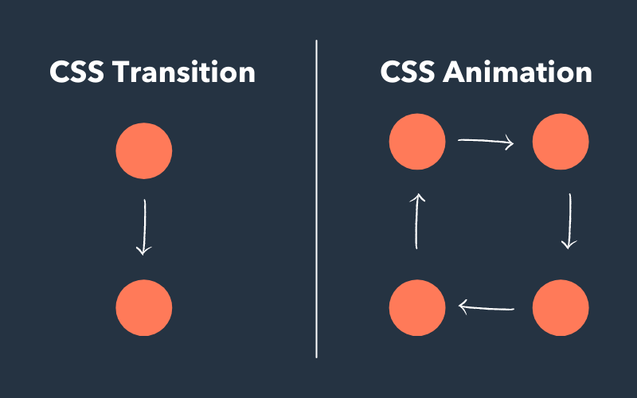

# Animation

- **Animation** là thuộc tính tạo hiệu ứng cho phần tử

## Sự khác nhau giữa Transition và Animation

| Property                                                                                               | Value                                                                                                          |
| ------------------------------------------------------------------------------------------------------ | -------------------------------------------------------------------------------------------------------------- |
| Tạo hiệu ứng cho phần tử từ trạng thái bắt đầu đến trạng thái kết thúc. Không có trạng thái trung gian | Tạo hiệu ứng cho phần tử từ trạng thái bắt đầu đến trạng thái kết thúc, có thể có trạng thái trung gian ở giữa |
| Hiệu ứng chỉ có thể chạy một lần duy nhất                                                              | Có thể chạy tới số lần ta chỉ định hoặc chạy vô hạn                                                            |
| Hiệu ứng cần trigger để chạy (như hover, focus)                                                        | Có thể trigger hoặc nó có thể chạy tự động                                                                     |



## Định nghĩa một animation

- Cú pháp:

```css
@keyframes animationName {
    keyframes-selector { css-styles }
}
```

:::info

Trong đó:

- **animationName** : tên của hiệu ứng
- **keyframes-selector** : Các mốc của animation, giá trị từ 0-100% hoặc `from` (tương đương 0%), `to` (tương đương 100%)
- **css-styles** : tạo kiểu CSS cho animation

:::

- Ví dụ:

```css
@keyframes moving {
  0% {
    top: 0px;
  }
  25% {
    top: 200px;
  }
  50% {
    top: 100px;
  }
  75% {
    top: 200px;
  }
  100% {
    top: 0;
  }
}
```

```css
@keyframes moving {
  from {
    top: 0;
    width: 100px;
    background-color: red;
  }
  to {
    top: 200px;
    width: 300px;
    background-color: yellow;
  }
}
```

## Các thuộc tính cho Animation

| Property                    | Value                                                                                                                                                                                                                                                                                                                                                                                                                                                                                                                                                                                                                               |
| --------------------------- | ----------------------------------------------------------------------------------------------------------------------------------------------------------------------------------------------------------------------------------------------------------------------------------------------------------------------------------------------------------------------------------------------------------------------------------------------------------------------------------------------------------------------------------------------------------------------------------------------------------------------------------- |
| `animation-name`            | Là tên của hiệu ứng ([animationName](#định-nghĩa-một-animation))                                                                                                                                                                                                                                                                                                                                                                                                                                                                                                                                                                    |
| `animation-duration`        | `as`: Chỉ định chu kỳ của animation                                                                                                                                                                                                                                                                                                                                                                                                                                                                                                                                                                                                 |
| `animation-timing-function` | `linear`: Tốc độ của animation ổn định từ khi bắt đầu đến khi kết thúc<br />`ease`: (Giá trị mặc định). Hiệu ứng ban đầu chậm, sau đó nhanh và kết thúc chậm<br />`ease-in`: Hiệu ứng ban đầu chậm<br />`ease-out`: Hiệu ứng kết thúc chậm<br />`ease-in-out`: Hiệu ứng ban đầu và kết thúc đều chậm                                                                                                                                                                                                                                                                                                                                |
| `animation-delay`           | `as`: Chỉ định thời gian delay trước khi animation chạy                                                                                                                                                                                                                                                                                                                                                                                                                                                                                                                                                                             |
| `animation-iteration-count` | Một**number** : chỉ định số lần animation chạy<br />`infinite`: Chỉ định animation sẽ chạy vô hạn không dừng                                                                                                                                                                                                                                                                                                                                                                                                                                                                                                                        |
| `animation-direction`       | `normal`: (Giá trị mặc định). Animation sẽ chạy theo hướng ban đầu được chỉ định<br />`reverse`: Animation chạy ngược với hướng ban đầu được chỉ định. Ví dụ chỉ định animation chạy từ trái sang phải. Nhưng với giá trị `reverse`, animation sẽ chạy theo hướng từ phải sang trái<br />`alternate`: Animation sẽ chạy theo kiểu chạy tới - chạy lui. Hoạt động khi thuộc tính `animation-iteration-count` có giá trị từ **2** trở lên hoặc `infinite`<br />`alternate-reverse`: Animation sẽ chạy theo kiểu chạy lui - chạy tới. Hoạt động khi thuộc tính `animation-iteration-count` có giá trị từ **2** trở lên hoặc `infinite` |
| `animation-fill-mode`       | `forwards`: Khi animation chạy xong. Phần tử sẽ đứng yên tại vị trí nó kết thúc<br />`backwards`: Khi animation chạy xong. Phần tử sẽ quay trở lại vị trí ban đầu nó xuất phát                                                                                                                                                                                                                                                                                                                                                                                                                                                      |
| `animation-play-state`      | `paused`: Chỉ định animation dừng lại<br />`running`: Chỉ định animation hoạt động                                                                                                                                                                                                                                                                                                                                                                                                                                                                                                                                                  |
| `animation`                 | **Name** **Duration** **Timing-function** **Delay** **Iteration-count** **Direction** **Fill-mode** **Play-state** <br />Cú pháp viết tắt cho tất cả thuộc tính trên theo thứ tự được chỉ định                                                                                                                                                                                                                                                                                                                                                                                                                                      |
