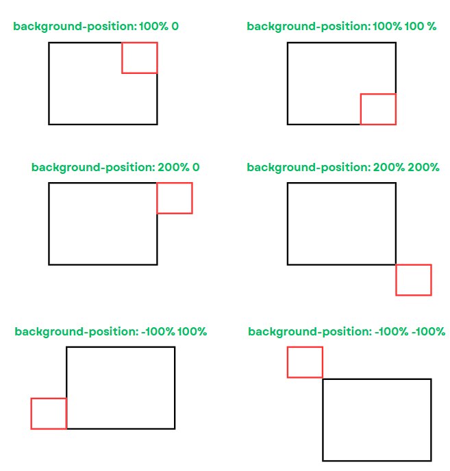

# Background

- **Background** dùng để tạo kiểu cho nền.

| Property                | Value                                                                                                                                                                                                                                                                                                                                                                                                                                                                                                                                                                                                                                                                                                                    |
| ----------------------- | ------------------------------------------------------------------------------------------------------------------------------------------------------------------------------------------------------------------------------------------------------------------------------------------------------------------------------------------------------------------------------------------------------------------------------------------------------------------------------------------------------------------------------------------------------------------------------------------------------------------------------------------------------------------------------------------------------------------------ |
| `background-color`      | Tên màu ở hệ RGB hoặc hex<br />`transparent`: màu trong suốt                                                                                                                                                                                                                                                                                                                                                                                                                                                                                                                                                                                                                                                             |
| `background-image`      | Tạo kiểu nền là hình ảnh hoặc màu linear gradient<br />`linear-gradient(...)`<br />`url("Link to image")`                                                                                                                                                                                                                                                                                                                                                                                                                                                                                                                                                                                                                |
| `background-attachment` | `scroll`: ảnh nền bị cuộn lên khi ta cuộn xuống<br />`fixed`: ảnh nền luôn được cố định khi ta cuộn lên/xuống                                                                                                                                                                                                                                                                                                                                                                                                                                                                                                                                                                                                            |
| `background-repeat`     | `no-repeat`: không lặp lại ảnh nền<br />`repeat`: nếu kích thước ảnh nền không vừa với container, ảnh nền đó sẽ được lặp lại theo chiểu dọc lẫn chiều ngang để phủ toàn bộ container<br />`repeat-x`: ảnh nền lặp lại theo chiều ngang<br />`repeat-y`: ảnh nền lặp lại theo chiều dọc                                                                                                                                                                                                                                                                                                                                                                                                                                   |
| `background-size`       | Thiết lập kích thước cho hình nền<br />`apx bpx`: Thiết lập kích thước hình nền ở dạng pixel, giá trị thứ nhất là chiều dài, giá trị thứ hai là chiều cao<br />`x% y%`: Thiết lập kích thước ở dạng phần trăm so với kích thước của container<br />`cover`: Ảnh vẫn được giữ nguyên tỉ lệ như ban đầu, **có thể bị cắt xén** và sẽ **fill kín toàn bộ container**<br />`contain`: Ảnh vẫn được giữ nguyên tỉ lệ như ban đầu, **không bị cắt xén** nhưng **có thể không fill kín hết container**                                                                                                                                                                                                                          |
| `background-clip`       | `border-box`: ảnh nền được bao phủ từ phần border của container trở vào trong<br />`padding-box`: ảnh nền được bao phủ từ phần padding của container trở vào trong<br />`content-box`: ảnh nền được bao phủ từ phần content của container trở vào trong<br />`text`: ảnh nền chỉ bao phủ bên text                                                                                                                                                                                                                                                                                                                                                                                                                        |
| `background-origin`     | Xác định vị trí bắt đầu (gốc) của hình ảnh nền trong một phần tử. Nó kiểm soát cách hình ảnh nền được đặt tương đối với các vùng của phần tử như vùng nội dung (content), vùng đệm (padding) hoặc vùng viền (border).<br />`padding-box` (mặc định): Hình ảnh nền được đặt bắt đầu từ vùng **padding** (bao gồm nội dung và phần padding, nhưng không bao gồm border).<br />`border-box`: Hình ảnh nền được đặt bắt đầu từ vùng **border** (bao gồm border, padding và content).<br />`content-box`: Hình ảnh nền được đặt bắt đầu từ vùng **content** (chỉ bao gồm content, không bao gồm padding hoặc border).<br />Xem ví dụ [tại đây](https://www.w3schools.com/cssref/tryit.php?filename=trycss3_background-origin) |
| `background`            | Là cú pháp viết ngắn gọn theo thứ tự:<br />`<background-color>` `<background-image>` `<background-position>` `<background-size>` `<background-repeat>` `<background-origin>` `<background-clip>` `<background-attachment>`<br />Ta không cần phải khai báo đủ tất cả các thuộc tính — chỉ cần viết những ta cần.                                                                                                                                                                                                                                                                                                                                                                                                         |

## background-position

- Thuộc tính CSS `background-position` dùng để **xác định vị trí hiển thị của hình nền (background image)** trong phần tử.
- Cú pháp:

```css
background-position: <giá trị ngang> <giá trị dọc>;
```

🔹 Các giá trị mà `background-position` có thể nhận:

#### 1. **Từ khóa định hướng** :

- `left`, `center`, `right` (cho **trục ngang**)
- `top`, `center`, `bottom` (cho **trục dọc**)

📌 Ví dụ:

```css
background-position: top left;
background-position: center center;
background-position: bottom right;
```

#### 2. **Giá trị đơn vị (px, %, em, rem, ...)**

- Dùng để chỉ định khoảng cách chính xác từ cạnh phần tử.
- `%` dựa trên kích thước của **phần tử container chứa hình nền**.

📌 Ví dụ:

```css
background-position: 20px 10px; /* 20px từ trái, 10px từ trên */
background-position: 50% 50%; /* chính giữa */
background-position: 100% 0%; /* góc trên bên phải */
```

:::note[Thông tin thêm]

- Giá trị của `background-position` có thể nhận **GIÁ TRỊ ÂM**. Hình nền sẽ dịch chuyển sang trái (theo chiều ngang), lên trên (theo chiều dọc). Bạn có thể thử ở trình live code bên dưới.

:::

#### 3. **Chỉ một giá trị**

- Nếu chỉ ghi **1 giá trị** , trình duyệt hiểu như sau:
  - Nếu là từ khóa (`left`, `center`, `right`), thì trục dọc mặc định là `center`.
  - Nếu là độ dài hoặc phần trăm, trục dọc sẽ mặc định là `center`.

📌 Ví dụ:

```css
background-position: right; /* tương đương right center */
background-position: 30px; /* tương đương 30px center */
```

## Một số chú ý

:::info[Ghi chú]

- Ta có thể chỉ định một hoặc nhiều background, và được ngăn cách nhau bằng dấu phẩy, ví dụ:

```css
.box {
  padding: 10px;
  background-color: #cccccc;
  background-image: url("img_tree.gif"), url("paper.gif");
  background-repeat: no-repeat, repeat;
  background-origin: content-box, padding-box;
}
```

:::



## Một số ví dụ

### Thay đổi đoạn code dưới đây để xem demo về `background-size`, `background-position`:

```jsx live
function MyComponent(props) {
  return (
    <>
      <style
        dangerouslySetInnerHTML={{
          __html: `
            .box {
              width: 400px;
              height: 300px;
              background-color: red;
              background-image: url(https://images.unsplash.com/photo-1744039046459-411801eef170?q=80&w=1974&auto=format&fit=crop&ixlib=rb-4.1.0&ixid=M3wxMjA3fDB8MHxwaG90by1wYWdlfHx8fGVufDB8fHx8fA%3D%3D);
              background-repeat: no-repeat;
              background-size: 50% 50%;
              background-position: 50% 50%;
            }

            .box:hover {
              background-color: red;
            }
          `,
        }}
      />
      <div className="box"></div>
    </>
  );
}
```

### Tạo linear gradient text bằng cách sử dụng `background-clip: text`:

```jsx live
function MyComponent(props) {
  return (
    <>
      <style
        dangerouslySetInnerHTML={{
          __html: `
            h1.my-text {
              background-image: linear-gradient(
                268.67deg,
                rgb(255, 240, 102) 15.69%,
                rgb(255, 163, 26) 55.54%,
                rgb(255, 0, 115) 99%
              );
              background-clip: text;
              -webkit-background-clip: text;
              color: transparent;
            }
          `,
        }}
      />
      <h1 className="my-text">Chào mừng bạn đến với trang web của chúng tôi</h1>
    </>
  );
}
```

### Tạo linear gradient border:

- Bạn nên chuyển chế độ trang web về light mode để xem rõ hơn.

```jsx
function MyComponent(props) {
  return (
    <>
      <style
        dangerouslySetInnerHTML={{
          __html: `
            .gradient-border-background {
              width: 300px;
              height: 300px;
              border: 3px solid transparent;
              border-radius: 8px;
              background-image: linear-gradient(white, white),
                linear-gradient(104deg, #6bbffb, #8591ff 48%, #d293f2 96%);
              background-origin: border-box;
              background-clip: padding-box, border-box;
              padding: 10px;
            }
          `,
        }}
      />
      <div className="gradient-border-background">
        <p>Hello World</p>
      </div>
    </>
  );
}
```

- Ở ví dụ dưới đây, bạn nên chuyển lại trang web về dark mode để xem 😆😆😆

```jsx
function MyComponent(props) {
  return (
    <>
      <style
        dangerouslySetInnerHTML={{
          __html: `
            .gradient-border-background-2 {
              width: 300px;
              height: 300px;
              position: relative;
              background-clip: padding-box;
              border: 2px solid transparent;
              background-color: #fff;
              border-radius: 8px;
              padding: 16px;
            }

            .gradient-border-background-2:before {
              content: '';
              position: absolute;
              inset: 0;
              z-index: -1;
              margin: -5px;
              background-image: linear-gradient(to right top, #2979ff, #07a787);
              border-radius: inherit;
            }
          `,
        }}
      />
      <div className="gradient-border-background-2">
        <p>Hello World</p>
      </div>
    </>
  );
}
```
