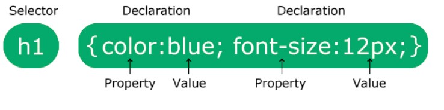

# Giới thiệu

## CSS Selectors là gì?

- **CSS Selectors** dùng để tìm (hoặc chọn) thẻ HTML mà bạn muốn tạo kiểu
- **CSS Selectors** được chia làm 5 loại:
  - [Simple selectors](./css-selectors/simple-selectors)
  - [Combinator selectors](./css-selectors/combinator-selectors)
  - [Pseudo-class selectors](./css-selectors/pseudo-class-selectors)
  - [Pseudo-elements selectors](./css-selectors/pseudo-elements-selectors)
  - [Attribute selectors](./css-selectors/attribute-selectors)
