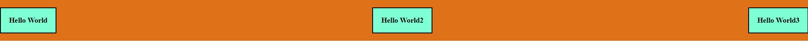
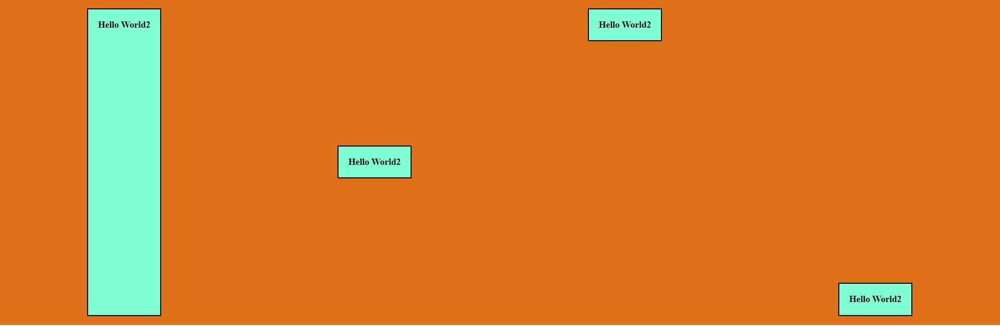

# Container

## Thuộc tính áp dụng cho flex container

| Property          | Value                                                                                                                                                                                                                                                                                                                                                                                                    |
| ----------------- | -------------------------------------------------------------------------------------------------------------------------------------------------------------------------------------------------------------------------------------------------------------------------------------------------------------------------------------------------------------------------------------------------------- |
| `display`         | `flex`: chỉ định kiểu hiển thị flexbox cho container                                                                                                                                                                                                                                                                                                                                                     |
| `flex-direction`  | `row`: các items sẽ được hiển thị theo chiều ngang  `row-reverse`: các item sẽ được hiển thị theo chiều ngang nhưng thứ tự bị đảo lộn lại  `column`: các items sẽ được hiển thị theo chiều dọc  `column-reverse`: các item sẽ được hiển thị theo chiều dọc nhưng thứ tự bị đảo lộn lại                                                                                                    |
| `justify-content` | `flex-start:` các items sẽ được đặt ở đầu của container `flex-end`: các items sẽ được đặt ở cuối của container `center`: các items sẽ được đặt ở giữa của container `space-between`: Tạo khoảng trống đều nhau **GIỮA** các items  `space-around`: Tạo khoảng trống ở **TRƯỚC, GIỮA, SAU** các items `space-evenly`: Tạo khoảng trống đều nhau ở **TRƯỚC, GIỮA, SAU** các items |
| `gap`             | `apx bpx`  **a** : độ rộng khoảng trống giữa các item theo chiều ngang  **b** : độ rộng khoảng trống giữa các item theo chiều dọc                                                                                                                                                                                                                                                              |
| `align-items`     | `stretch`: tất cả items sẽ trải dài hết container `br`: tất cả items sẽ ở chính giữa container  `flex-start`: tất cả items sẽ ở trên cùng của container  `flex-end`: tất cả items sẽ ở dưới cùng của container                                                                                                                                                                                 |
| `flex-wrap`       | Khi ta kéo nhỏ trình duyệt, các items của bên trong container có thể bị thu hẹp, không giữ được hình dạng ban đầu. Vì vậy `flex-wrap` giúp chúng ta có thể đưa các items không đủ chỗ để hiển thị sẽ hiển thị ở phía dưới hoặc trên  `wrap`: Các items không đủ chỗ để hiển thị sẽ hiển thị xuống bên dưới  `wrap-reverse`: Các items không đủ chỗ để hiển thị sẽ hiển thị ở bên trên          |

- Hình ảnh minh họa các giá trị của thuộc tính `justify-content` với `flex-direction: row`:

- Hình ảnh minh họa các giá trị của thuộc tính `align-items `với `flex-direction: row`:

