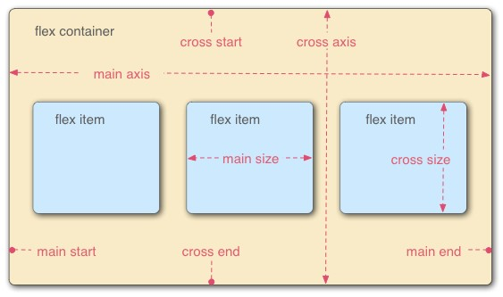

# Giới thiệu

- **Flexbox** là một kiểu dàn trang (layout mode) mà nó sẽ tự cân đối kích thước của các phần tử bên trong để hiển thị trên mọi thiết bị.
- Dưới đây là sơ đồ cấu trúc **Flexbox**

Hai thành phần quan trọng nhất trong một bố cục **Flexbox** là gồm **container** và **item** :

- [**Container**](./container): là thành phần lớn bao quanh các phần tử bên trong, bạn sẽ thiết lập kiểu hiển thị inline (sắp xếp theo chiều ngang) hoặc kiểu sắp xếp theo chiều dọc. Khi đó, các item bên trong sẽ hiển thị dựa trên thiết lập của container này.
- [**Item**](./item): Các phần tử con của container được gọi là item, ở item bạn có thể thiết lập nó sẽ sử dụng bao nhiêu cột trong một container, hoặc thiết lập thứ tự hiển thị của nó.
