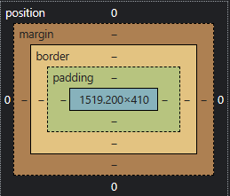

# Layout of element

- Layout của một phần tử theo thứ tự từ trong ra ngoài gồm các phần:
  - **content** (màu xanh da trời)
  - **padding**
  - **border**
  - **outline**
  - **margin**

## Border

- **Border** để tạo kiểu cho đường viền bao quanh bên ngoài.

| Property                                                                                                                   | Value                                                                                                                           |
| -------------------------------------------------------------------------------------------------------------------------- | ------------------------------------------------------------------------------------------------------------------------------- |
| `border-width`                                                                                                             | `apx`: Độ rộng của đường viền                                                                                                   |
| `border-style`                                                                                                             | `solid`: đường viền liền  `dotted`: đường viền chấm : đường viền gạch ngang : đường viền kép  `none`: không đường viề |
| `border-color`                                                                                                             | Mã màu ở hệ hexal, RGB,...                                                                                                      |
| `border`                                                                                                                   | `Width Style Color`: Cú pháp viết tắt tạo kiểu đường viền                                                                       |
| `border-top` `border-bottom` `border-left` `border-right`                                                   | `Width Style Color`: Cú pháp viết tắt tạo kiểu đường viền trên, dưới, trái, phải                                                |
| `border-radius`                                                                                                            | `apx bpx cpx dpx` hoặc `a% b% c% d%` : Tạo độ cong ở góc lần lượt: trái trên - phải trên - phải dưới - trái dưới                |
| `border-top-left-radius` `border-top-right-radius` `border-bottom-left-radius` `border-bottom-right-radius` | `apx` hoặc `a%`: Tạo độ cong cho từng góc                                                                                       |

## Outline

- **Outline** là thuộc tính tạo đường viền bên ngoài
- **Outline** khác **border** ở 3 điểm:

  - **Outline** là một đường bao quanh các phần tử, nằm bên ngoài cạnh border
  - **Outline** không chiếm không gian
  - **Outline** có thể không phải là hình chữ nhật

| Property         | Value                                                                                                                           |
| ---------------- | ------------------------------------------------------------------------------------------------------------------------------- |
| `outline-width`  | `apx`: Chỉ định độ dày đường viền                                                                                               |
| `outline-style`  | `solid`: đường viền liền : đường viền chấm : đường viền gạch ngang  `double`: đường viền kép `none`: không đường viền |
| `outline-color`  | Mã màu ở hệ hexal, RGB,…                                                                                                        |
| `outline`        | `Width Style Color`: Là cú pháp viết tắt cho 3 thuộc tính trên                                                                  |
| `outline-offset` | `apx`: Tạo khoảng trống giữa outline so với cạnh của border                                                                     |

:::tip

Để xóa phần đường viền ở thẻ `<input/>`, ta có thể sử dụng `outline: none`

:::

## Padding

- **Padding** là độ dày phần bao quanh giữa **content** và **border**

| Property                                                                     | Value                                                                                  |
| ---------------------------------------------------------------------------- | -------------------------------------------------------------------------------------- |
| `padding-top` `padding-bottom` `padding-left` `padding-right` | `apx`: Tạo độ dày cho phần padding trên, dưới, trái, phải                              |
| `padding`                                                                    | Là cú pháp viết tắt của 4 thuộc tính trên `apx bpx cpx dpx`: trên - phải - dưới – trái |

## Margin

- **Margin** là phần nằm ngoài phần **border**

| Property                                                                 | Value                                                                                              |
| ------------------------------------------------------------------------ | -------------------------------------------------------------------------------------------------- |
| `margin-top` `margin-bottom` `margin-left` `margin-right` | `apx`: Tạo độ dày cho phần margin phía trên, dưới, trái, phải                                      |
| `margin`                                                                 | Là cú pháp viết tắt của 4 thuộc tính trên `apx bpx cpx dpx`: theo thứ tự trên - phải - dưới – trái |

- Thuộc tính `margin-top`, `margin-bottom`, `margin-left`, `margin-right` còn có thể nhận một giá trị nữa là `auto`. Khi nhận giá trị này, phần tử sẽ:
  - Bị đẩy xuống dưới cùng của container nếu `margin-top: auto`
  - Bị đẩy lên trên cùng của container nếu `margin-bottom: auto`
  - Bị đẩy sang phải cùng của container nếu `margin-left: auto`
  - Bị đẩy sang trái cùng của container nếu `margin-right: auto`
  - Bị đẩy ra chính giữa theo chiều ngang của container nếu kết hợp `margin-left: auto` và `margin-right: auto`

:::caution

Chú ý: điều kiện để có thể sử dụng giá trị `auto` là:

- Phần tử ở dạng cấp khối (`display: block`)
- Phần tử **KHÔNG** có thuộc tính `position: fixed` hoặc `position: absolute`
- Phần tử **PHẢI** có thuộc tính `width` ở dạng pixel

:::

- `margin-top`, `margin-bottom`, `margin-left`, `margin-right` có thể nhận giá trị âm. Ví dụ `margin-top: -5px` sẽ đẩy phần tử lên trên **5px** thay vì đẩy phần tử xuống **5px** . Các thuộc tính khác tương tự.

## Box-sizing

- `box-sizing` là một thuộc tính CSS dùng để chỉ định phương thức tính kích thước của một box model, bao gồm `content`, `padding`, và `border`.
- `box-sizing: border-box`: kích thước của box model bao gồm `content`, `padding`, và `border` sẽ được tính toán chung, kích thước của box sẽ tính toán dựa trên giá trị này. Điều này có thể giúp cho thiết kế trang web trở nên dễ dàng hơn khi muốn điều chỉnh kích thước các phần tử và tránh tình trạng bị đè lên nhau.
