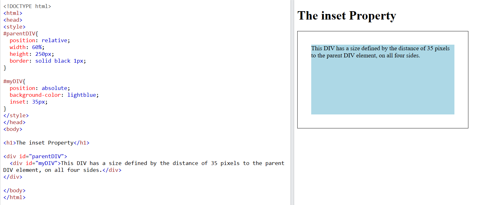

# Position

- Trong CSS, `position` là thuộc tính dùng để chỉ định vị trí của một phần tử HTML trên trang web.

| Property   | Value                                                                                                                                                                                                                                                                                                                                                                                                                                                                                                                                                                                                                               |
| ---------- | ----------------------------------------------------------------------------------------------------------------------------------------------------------------------------------------------------------------------------------------------------------------------------------------------------------------------------------------------------------------------------------------------------------------------------------------------------------------------------------------------------------------------------------------------------------------------------------------------------------------------------------- |
| `position` | `static`: đây là giá trị mặc định nếu phần tử không được chỉ định thuộc tính position. Phần tử được xếp theo thứ tự của HTML<br />`relative`: phần tử được xếp theo vị trí mặc định. Khi phần tử được di chuyển, nó không ảnh hưởng đến vị trí các phần tử khác trên trang.<br />`absolute`: phần tử được đặt ở vị trí cụ thể trong khối cha. Khi sử dụng `absolute`, phần tử sẽ không chiếm vị trí trên trang web và nó dựa vào vị trí của khối cha có `position` khác `static`, nếu không có khối cha thỏa mãn thì sẽ dựa vào thẻ `<body>`.<br />`fixed`: phần tử luôn được giữ cố định, không bị di chuyển khi cuộn thanh scroll |

- Thuộc tính `position` cũng đi cùng với các thuộc tính `top`, `bottom`, `right`, `left` để di chuyển phần tử

| Property | Value                                                                              |
| -------- | ---------------------------------------------------------------------------------- |
| `left`   | `apx`: Thiết lập khoảng cách tính từ mép bên trái đến phần tử, cho phép giá trị âm |
| `right`  | `apx`: Thiết lập khoảng cách tính từ mép bên phải đến phần tử, cho phép giá trị âm |
| `top`    | `apx`: Thiết lập khoảng cách tính từ mép bên trên đến phần tử, cho phép giá trị âm |
| `bottom` | `apx`: Thiết lập khoảng cách tính từ mép bên dưới đến phần tử, cho phép giá trị âm |

- Các thuộc tính `left`, `right`, `bottom`, `top` sẽ di chuyển phần tử theo cách:
  - Nếu phần tử có `position: relative`: di chuyển phần tử so với vị trí ban đầu của nó
  - Nếu phần tử có `position: absolute` hoặc `position: fixed`: di chuyển phần tử so với **mép ngoài cùng** của phần tử cha gần nhất có `position` khác `static`, nếu không có phần tử cha thỏa mãn, sẽ di chuyển so với thẻ `<body>`
- Nếu phần tử có `postition: absolute/fixed` mà thuộc tính `top`, `bottom`, `left`, `right` có giá trị đơn vị là **%** thì giá trị phần trăm đó được tính theo phần trăm **width** / **height** của phần tử cha. Ví dụ:

```html
<div class="w-[500px] h-[150px] relative">
  <div class="w-12 h-12 absolute left-[25%]">
    Phần tử con này sẽ cách phần tử cha về phía bên trái 25% so với chiều dài
    của phần tử cha. Tức 25% của 500px là 125px
  </div>
</div>
```

## inset

- Thuộc tính `inset` thiết lập vị trí (`top`, `bottom`, `right`, `left`) cho phần tử con có `position: absolute` so với phần tử cha có `position: relative` hoặc `position: absolute`

| Property | Value                                                                                         |
| -------- | --------------------------------------------------------------------------------------------- |
| `inset`  | `apx bpx cpx dpx`: Thiết lập vị trí trên, phải, dưới, trái cho phần tử con so với phần tử cha |


