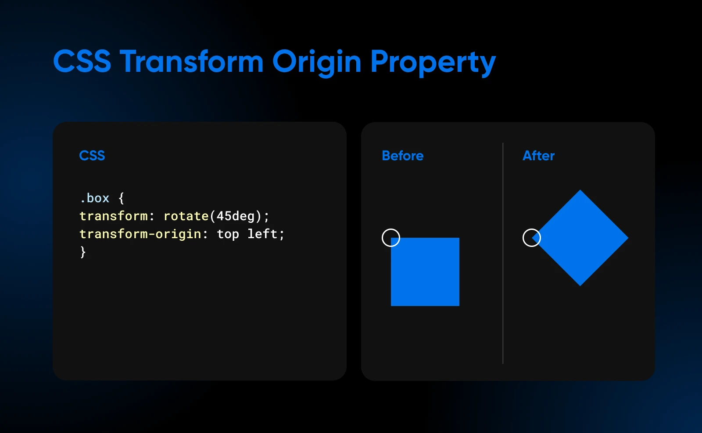
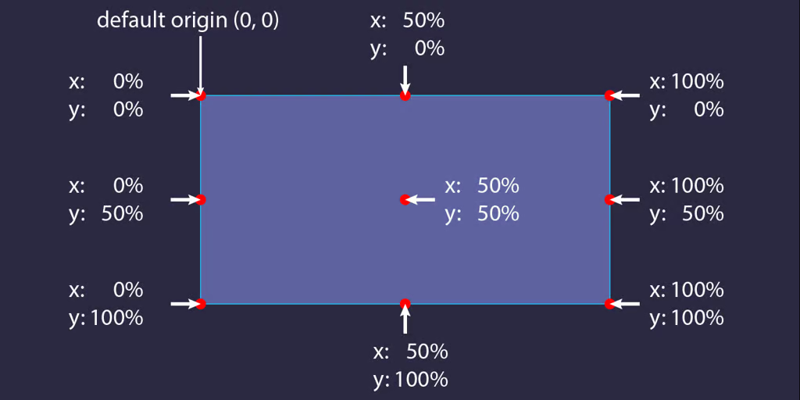

# Transform

- **Transform** là thuộc tính chuyển đổi phần tử. Nó cho phép bạn thay đổi vị trí, hình dáng và xoay các phần tử theo nhiều hướng khác nhau.

| Property           | Value                                                                                                                                                                                                                                                                                                                                                                                                                                                                                                                                                                                                                                                                                                                                                                       |
| ------------------ | --------------------------------------------------------------------------------------------------------------------------------------------------------------------------------------------------------------------------------------------------------------------------------------------------------------------------------------------------------------------------------------------------------------------------------------------------------------------------------------------------------------------------------------------------------------------------------------------------------------------------------------------------------------------------------------------------------------------------------------------------------------------------- |
| `transform`        | `scale(x)`: Phần tử sẽ được phóng to lên `x` lần so với ban đầu `translate(apx, bpx)`: Phần tử sẽ dịch chuyển theo chiều ngang `apx` về bên phải, theo chiều dọc `bpx` xuống dưới so với vị trí ban đầu. Nếu là giá trị phần trăm thì sẽ di chuyển theo chiều ngang, chiều dọc tương ứng với % chiều dài, chiều rộng của phần tử (cho phép giá trị âm, nếu có giá trị âm sẽ dịch chuyển theo chiều ngược lại) `rotate(adeg)`: Phần tử sẽ xoay a độ theo chiều kim đồng hồ so với phương ban đầu                                                                                                                                                                                                                                                                   |
| `transform-origin` | -`transform-origin` là một thuộc tính trong CSS xác định điểm gốc (điểm neo) của phép biến đổi (`transform`). Khi bạn áp dụng các phép biến đổi như `rotate`, `scale`, `translate`, hoặc `skew`, thuộc tính này quyết định vị trí bắt đầu của phép biến đổi đó. - Mặc định, `transform-origin` được đặt ở **tâm của phần tử (`50% 50%`)** . - Cú pháp: `transform-origin: x y z;` `x`: Xác định vị trí theo chiều ngang (có thể là phần trăm, pixel, từ khóa `left`, `center`, `right`). `y`: Xác định vị trí theo chiều dọc (`top`, `center`, `bottom` hoặc đơn vị đo lường). `z` (tùy chọn): Xác định trục Z (chỉ áp dụng khi có `perspective`). - Nếu nó có giá trị phần trăm, giá trị phần trăm này được tính theo kích thước của phần tử |

- Ví dụ về transform origin:

